# 🚕 NYC Taxi Data Pipeline

A production-ready **ELT data pipeline** for NYC Yellow Taxi trip data, featuring automated batch data ingestion from AWS S3, **real-time streaming with fraud detection**, transformation with dbt, and analytics-ready data marts in Snowflake.

## 📋 Table of Contents

- [🎯 Overview](#-overview)
- [🏗️ Architecture](#️-architecture)
- [📁 Project Structure](#-project-structure)
- [📊 Data Models](#-data-models)
- [📡 Real-Time Streaming](#-real-time-streaming)
- [🚀 Setup & Installation](#-setup--installation)
- [💻 Usage](#-usage)
- [✅ Data Quality](#-data-quality)
- [🤝 Contributing](#-contributing)

## 🎯 Overview

This project implements a complete **batch + real-time** data pipeline that:

- **Extracts** NYC Yellow Taxi trip data from the TLC public dataset
- **Loads** raw Parquet files into Snowflake via AWS S3
- **Transforms** data using dbt with a medallion architecture (staging → intermediate → marts)
- **Streams** real-time trip data through Kafka with Spark Streaming
- **Detects** fraudulent trips in real-time using custom rules
- **Orchestrates** batch workflows with Apache Airflow
- **Delivers** analytics-ready datasets for business intelligence

### Key Features

✅ Incremental data loading with sync state management  
✅ **Real-time streaming pipeline with Apache Kafka & Spark**  
✅ **Fraud detection system with 15+ detection rules**  
✅ **Live dashboard with Streamlit for real-time monitoring**  
✅ Data quality tests and validation  
✅ One Big Table (OBT) for simplified analytics  
✅ 11 pre-built business insights ready for visualization  
✅ Infrastructure as Code with AWS Lambda  

## 🏗️ Architecture

### Batch Pipeline

```mermaid
flowchart LR
    A[🌐 NYC TLC\nOpen Data] --> B[☁️ AWS S3\nRaw Storage]
    B --> C[❄️ Snowflake\nData Cloud]
    C --> D[🔄 dbt\nTransforms]
    C --> E[⏰ Airflow\nOrchestration]
    D <--> E
    D --> F[📥 Staging]
    F --> G[🔧 Intermediate]
    G --> H[📊 Marts]
```

### Real-Time Streaming Pipeline

```mermaid
flowchart LR
    A[🚕 Taxi App] --> B[⚡ FastAPI\nWebhook]
    B --> C[📨 Kafka\nBroker]
    C --> D[🔥 Spark\nStreaming]
    D --> E[💾 Redis\nCache]
    E --> F[📈 Streamlit\nDashboard]
```

## 📁 Project Structure

\`\`\`
nyc-taxi-data-pipeline/
├── airflow/
│   └── dags/
│       ├── deploy_infrastructure_dag.py
│       ├── nyc_taxi_sync_dag.py
│       └── scripts/
│           └── sync_manager.py
├── infrastructure/
│   ├── deploy_lambda.py
│   └── lambda_function.py
├── nyc_taxi_dbt/
│   ├── dbt_project.yml
│   ├── models/
│   │   ├── staging/
│   │   │   ├── stg_trips.sql
│   │   │   └── stg_zones.sql
│   │   ├── intermediate/
│   │   │   └── int_trips_validated.sql
│   │   └── marts/
│   │       ├── core/
│   │       │   ├── obt_trips.sql
│   │       │   ├── dim_zones.sql
│   │       │   ├── dim_payment_types.sql
│   │       │   └── dim_rate_codes.sql
│   │       ├── aggregations/
│   │       │   ├── agg_monthly.sql
│   │       │   ├── agg_quarterly.sql
│   │       │   └── agg_yearly.sql
│   │       └── insights/
│   │           ├── insight_uber_effect.sql
│   │           ├── insight_covid_recovery.sql
│   │           ├── insight_airport_lifeline.sql
│   │           ├── insight_payment_shift.sql
│   │           ├── insight_manhattan_share.sql
│   │           ├── insight_tipping_patterns.sql
│   │           ├── insight_route_pricing.sql
│   │           ├── insight_fee_impact.sql
│   │           ├── insight_zone_heatmap.sql
│   │           ├── insight_anomaly_breakdown.sql
│   │           └── insight_industry_evolution.sql
│   └── tests/
│       ├── assert_pickup_before_dropoff.sql
│       ├── assert_positive_fares.sql
│       ├── assert_valid_speed.sql
│       └── assert_valid_trip_duration.sql
├── streaming/
│   ├── docker/
│   │   └── docker-compose.yml
│   ├── api/
│   │   ├── main.py
│   │   ├── schemas.py
│   │   ├── kafka_producer.py
│   │   └── requirements.txt
│   ├── spark/
│   │   ├── fraud_detector.py
│   │   └── requirements.txt
│   ├── dashboard/
│   │   ├── app.py
│   │   ├── pages/
│   │   │   ├── 1_📊_Live_Overview.py
│   │   │   └── 2_🕵️_Fraud_Detection.py
│   │   ├── utils/
│   │   └── requirements.txt
│   ├── simulator/
│   │   ├── send_trips.py
│   │   └── requirements.txt
│   └── README.md
├── scripts/
│   └── download_zone_lookup.py
├── snowflake/
│   └── setup.sql
└── README.md
\`\`\`

## 📊 Data Models

### Snowflake Database Structure
\`\`\`
NYC_TAXI_DB
│
├── RAW_staging (Views)
│   ├── stg_trips
│   └── stg_zones
│
├── RAW_intermediate (Views)
│   └── int_trips_validated
│
├── RAW_marts (Tables)
│   ├── dim_zones              ← Dimension
│   ├── dim_payment_types      ← Dimension
│   ├── dim_rate_codes         ← Dimension
│   ├── obt_trips              ← One Big Table (Denormalized)
│   ├── agg_monthly            ← Aggregated
│   ├── agg_quarterly          ← Aggregated
│   └── agg_yearly             ← Aggregated
│
└── RAW_insights (Tables - Ready for Visualization)
    ├── insight_uber_effect
    ├── insight_covid_recovery
    ├── insight_airport_lifeline
    ├── insight_payment_shift
    ├── insight_manhattan_share
    ├── insight_tipping_patterns
    ├── insight_route_pricing
    ├── insight_fee_impact
    ├── insight_zone_heatmap
    ├── insight_anomaly_breakdown
    └── insight_industry_evolution
\`\`\`

### Staging Layer (Views)
| Model | Description |
|-------|-------------|
| \`stg_trips\` | Cleaned raw trip records with standardized column names |
| \`stg_zones\` | NYC taxi zone reference data |

### Intermediate Layer (Views)
| Model | Description |
|-------|-------------|
| \`int_trips_validated\` | Trips with data quality validation and filtering |

### Marts Layer (Tables)

#### Dimensions
| Model | Description |
|-------|-------------|
| \`dim_zones\` | Pickup/dropoff location attributes |
| \`dim_payment_types\` | Payment method lookup |
| \`dim_rate_codes\` | Rate code descriptions |

#### One Big Table
| Model | Description |
|-------|-------------|
| \`obt_trips\` | Denormalized table with all trip data for easy analytics |

#### Aggregations
| Model | Description |
|-------|-------------|
| \`agg_monthly\` | Monthly KPIs: trips, revenue, avg fare, tips |
| \`agg_quarterly\` | Quarterly performance metrics |
| \`agg_yearly\` | Yearly trends and YoY comparisons |

### Insights Layer (Tables - Ready for Visualization)
| Model | Description |
|-------|-------------|
| \`insight_uber_effect\` | Impact of rideshare competition |
| \`insight_covid_recovery\` | COVID-19 impact and recovery analysis |
| \`insight_airport_lifeline\` | Airport trip importance analysis |
| \`insight_payment_shift\` | Cash to card payment transition |
| \`insight_manhattan_share\` | Manhattan vs outer borough trends |
| \`insight_tipping_patterns\` | Tipping behavior analysis |
| \`insight_route_pricing\` | Popular route pricing patterns |
| \`insight_fee_impact\` | Congestion surcharge and fee analysis |
| \`insight_zone_heatmap\` | Pickup/dropoff zone activity |
| \`insight_anomaly_breakdown\` | Data quality anomaly detection |
| \`insight_industry_evolution\` | Long-term industry trends (2009-present) |

## 📡 Real-Time Streaming

The streaming module provides real-time taxi trip processing with fraud detection.

### Components
- **FastAPI Server**: Webhook receiver for incoming trips
- **Apache Kafka**: Message broker for trip events
- **Spark Streaming**: Real-time fraud detection engine
- **Redis**: Metrics caching layer
- **Streamlit Dashboard**: Live monitoring UI

### Fraud Detection Rules
The system detects fraud using 15+ rules including:
- Impossible speed (> 100 mph)
- Zero distance with fare
- Tip exceeds fare amount
- Fake airport fees
- Night cash trip patterns
- And more...

### Quick Start
\`\`\`bash
# Start infrastructure
cd streaming/docker && docker-compose up -d

# Start API server
cd streaming/api && uvicorn main:app --port 8000

# Start Spark fraud detector
cd streaming/spark && spark-submit fraud_detector.py

# Start dashboard
cd streaming/dashboard && streamlit run app.py
\`\`\`

See [streaming/README.md](streaming/README.md) for detailed documentation.

## 🚀 Setup & Installation

### Prerequisites

- Python 3.9+
- Snowflake account
- AWS account (for S3 storage)
- Apache Airflow 2.0+
- Docker (for streaming)

### 1. Clone the Repository

\`\`\`bash
git clone https://github.com/abdulrahman532/nyc-taxi-data-pipeline.git
cd nyc-taxi-data-pipeline
\`\`\`

### 2. Set Up Python Environment

\`\`\`bash
python -m venv dbt_venv
source dbt_venv/bin/activate
pip install dbt-snowflake apache-airflow boto3
\`\`\`

### 3. Configure Snowflake

Run the setup script in Snowflake:

\`\`\`sql
-- Execute snowflake/setup.sql in Snowflake Worksheets
\`\`\`

### 4. Configure dbt Profile

Create \`~/.dbt/profiles.yml\`:

\`\`\`yaml
nyc_taxi:
  target: dev
  outputs:
    dev:
      type: snowflake
      account: <your_account>
      user: <your_user>
      password: <your_password>
      role: DATA_ENGINEER
      database: NYC_TAXI_DB
      warehouse: TAXI_WH
      schema: RAW
      threads: 4
\`\`\`

### 5. Install dbt Packages

\`\`\`bash
cd nyc_taxi_dbt
dbt deps
\`\`\`

## 💻 Usage

### Run dbt Models

\`\`\`bash
cd nyc_taxi_dbt

# Run all models
dbt run

# Run specific layer
dbt run --select staging
dbt run --select intermediate
dbt run --select marts

# Run only insights
dbt run --select insights

# Run with tests
dbt build
\`\`\`

### Run Data Tests

\`\`\`bash
dbt test
\`\`\`

### Generate Documentation

\`\`\`bash
dbt docs generate
dbt docs serve
\`\`\`

### Trigger Airflow DAGs

\`\`\`bash
# Via Airflow CLI
airflow dags trigger nyc_taxi_sync_dag

# Or use the Airflow Web UI
\`\`\`

## ✅ Data Quality

The pipeline includes comprehensive data quality checks:

### Schema Tests
- Not null constraints
- Unique keys validation
- Accepted values checks

### Custom Tests
| Test | Description |
|------|-------------|
| \`assert_pickup_before_dropoff\` | Validates pickup time < dropoff time |
| \`assert_positive_fares\` | Ensures fares are positive |
| \`assert_valid_speed\` | Checks for reasonable trip speeds |
| \`assert_valid_trip_duration\` | Validates trip duration range |

## 📈 Sample Queries

### Monthly Revenue Trend
\`\`\`sql
SELECT * FROM NYC_TAXI_DB.MARTS.AGG_MONTHLY
ORDER BY year, month;
\`\`\`

### COVID Recovery Analysis
\`\`\`sql
SELECT * FROM NYC_TAXI_DB.MARTS.INSIGHT_COVID_RECOVERY
ORDER BY year, month;
\`\`\`

### Top Pickup Locations
\`\`\`sql
SELECT 
    pickup_zone,
    pickup_borough,
    COUNT(*) as trip_count,
    SUM(total_amount) as total_revenue
FROM NYC_TAXI_DB.MARTS.OBT_TRIPS
GROUP BY 1, 2
ORDER BY trip_count DESC
LIMIT 10;
\`\`\`

## 🤝 Contributing

1. Fork the repository
2. Create a feature branch (\`git checkout -b feature/amazing-feature\`)
3. Commit your changes (\`git commit -m 'Add amazing feature'\`)
4. Push to the branch (\`git push origin feature/amazing-feature\`)
5. Open a Pull Request

## 📄 License

This project is licensed under the MIT License - see the [LICENSE](LICENSE) file for details.

## 🙏 Acknowledgments

- [NYC Taxi & Limousine Commission](https://www.nyc.gov/site/tlc/about/tlc-trip-record-data.page) for the open dataset
- [dbt Labs](https://www.getdbt.com/) for the amazing transformation framework
- [Snowflake](https://www.snowflake.com/) for the cloud data platform

---

**Built with ❤️ by [Abdulrahman](https://github.com/abdulrahman532)**
