# 🚕 NYC Taxi Data Pipeline

[](https://python.org)
[](https://getdbt.com)
[](https://airflow.apache.org)
[](https://snowflake.com)
[](https://kafka.apache.org)
[](https://spark.apache.org)
[](LICENSE)

A production-ready **ELT data pipeline** for NYC Yellow Taxi trip data, featuring automated batch data ingestion from AWS S3, **real-time streaming with fraud detection**, transformation with dbt, and analytics-ready data marts in Snowflake.

## 📋 Table of Contents

- [🎯 Overview](#-overview)
- [🏗️ Architecture](#️-architecture)
- [📁 Project Structure](#-project-structure)
- [📊 Data Models](#-data-models)
- [📡 Real-Time Streaming](#-real-time-streaming)
- [🚀 Setup & Installation](#-setup--installation)
- [💻 Usage](#-usage)
- [✅ Data Quality](#-data-quality)
- [🤝 Contributing](#-contributing)

## 🎯 Overview

This project implements a complete **batch + real-time** data pipeline that:

- **Extracts** NYC Yellow Taxi trip data from the TLC public dataset
- **Loads** raw Parquet files into Snowflake via AWS S3
- **Transforms** data using dbt with a medallion architecture (staging → intermediate → marts)
- **Streams** real-time trip data through Kafka with Spark Streaming
- **Detects** fraudulent trips in real-time using custom rules
- **Orchestrates** batch workflows with Apache Airflow
- **Delivers** analytics-ready datasets for business intelligence

## 🔁 Recent updates (Nov 2025)

- Dashboard renamed to **TaxiPulse** — a single-file Streamlit app for real-time monitoring.
- Replaced blocking sleep + rerun loops with `streamlit-autorefresh` for near real-time updates. Use the Sidebar toggle `Realtime (live updates)` to enable a 250ms polling interval for a near-instant experience.
- Improved maps and visuals:
  - New PyDeck animated `TripsLayer` for moving route visualizations; start/end markers added.
  - Maps use a clearer red palette for pickup/dropoffs and show line widths scaled by estimated route volume.
  - Added borough labels for geographic context and a small "Top Estimated Routes" table.
- Fraud Monitor & Live Analytics pages updated: new charts, updated color palette (Reds), and removed deprecated Streamlit parameters.
- Admin & operational tools added:
  - Dashboard: small admin control to clear Redis data (`FLUSHALL`).
  - Scripts: `streaming/scripts/stop_local_simulators.sh` to kill host-level simulator processes.
  - Docker: `kafka-ui` host port changed to `8085` to avoid conflicts; dashboard container now has `restart: unless-stopped` for better resilience.
- Redis improvements:
  - Added `get_hourly_matrix(days=...)` helper in `streaming/dashboard/utils/redis_client.py` that aggregates trips by day-of-week and hour-of-day for Rush Hours heatmaps.
- Requirements:
  - Dashboard now includes `pydeck==0.9.0`, `numpy`, and `streamlit-autorefresh==0.1.6` in `streaming/dashboard/requirements.txt`.

These updates deliver a smoother near-realtime dashboard experience, clearer map visuals, and operational tools for managing local simulators and Redis storage.

### Key Features

✅ Incremental data loading with sync state management  
✅ **Real-time streaming pipeline with Apache Kafka & Spark**  
✅ **Fraud detection system with 15+ detection rules**  
✅ **Live dashboard with Streamlit for real-time monitoring**  
✅ Data quality tests and validation  
✅ One Big Table (OBT) for simplified analytics  
✅ 11 pre-built business insights ready for visualization  
✅ Infrastructure as Code with AWS Lambda  

## 🏗️ Architecture

### Batch Pipeline

```mermaid
flowchart LR
    A[🌐 NYC TLC\nOpen Data] --> B[☁️ AWS S3\nRaw Storage]
    B --> C[❄️ Snowflake\nData Cloud]
    C --> D[🔄 dbt\nTransforms]
    C --> E[⏰ Airflow\nOrchestration]
    D <--> E
    D --> F[📥 Staging]
    F --> G[🔧 Intermediate]
    G --> H[📊 Marts]
```



### Real-Time Streaming Pipeline

```mermaid
flowchart LR
    A[🚕 Taxi App] --> B[⚡ FastAPI\nWebhook]
    B --> C[📨 Kafka\nBroker]
    C --> D[🔥 Spark\nStreaming]
    D --> E[💾 Redis\nCache]
    E --> F[📈 Streamlit\nDashboard]
```



## 📁 Project Structure

| Directory | Description |
|-----------|-------------|
| **📂 airflow/** | Apache Airflow DAGs and orchestration scripts |
| ↳ `dags/` | Pipeline DAGs (`deploy_infrastructure_dag.py`, `nyc_taxi_sync_dag.py`) |
| ↳ `scripts/` | Helper scripts (`sync_manager.py`) |
| **📂 infrastructure/** | AWS Lambda deployment code |
| ↳ `deploy_lambda.py` | Lambda deployment script |
| ↳ `lambda_function.py` | S3 → Snowflake ingestion function |
| **📂 nyc_taxi_dbt/** | dbt transformation project |
| ↳ `models/staging/` | `stg_trips.sql`, `stg_zones.sql` |
| ↳ `models/intermediate/` | `int_trips_validated.sql` |
| ↳ `models/marts/core/` | `obt_trips.sql`, `dim_zones.sql`, `dim_payment_types.sql`, `dim_rate_codes.sql` |
| ↳ `models/marts/aggregations/` | `agg_monthly.sql`, `agg_quarterly.sql`, `agg_yearly.sql` |
| ↳ `models/marts/insights/` | 11 insight models (see Data Models section) |
| ↳ `tests/` | Data quality tests (4 custom assertions) |
| **📂 streaming/** | Real-time streaming pipeline |
| ↳ `docker/` | Docker Compose for Kafka, Zookeeper, Redis |
| ↳ `api/` | FastAPI webhook server |
| ↳ `spark/` | Spark Streaming fraud detector |
| ↳ `dashboard/` | Streamlit live monitoring dashboard |
| ↳ `simulator/` | Trip data simulator for testing |
| **📂 scripts/** | Utility scripts (`download_zone_lookup.py`) |
| **📂 snowflake/** | Database setup SQL (`setup.sql`) |

## 📊 Data Models

### Snowflake Database Structure

| Schema | Type | Tables/Views |
|--------|------|--------------|
| **RAW** | Tables | `TRIPS`, `TAXI_ZONES` |
| **BRONZE** | Views | `stg_trips`, `stg_zones` |
| **SILVER** | Views | `int_trips_validated` |
| **GOLD** | Tables | `dim_zones`, `dim_payment_types`, `dim_rate_codes`, `obt_trips`, `agg_monthly`, `agg_quarterly`, `agg_yearly` |
| **INSIGHTS** | Tables | `insight_uber_effect`, `insight_covid_recovery`, `insight_airport_lifeline`, `insight_payment_shift`, `insight_manhattan_share`, `insight_tipping_patterns`, `insight_route_pricing`, `insight_fee_impact`, `insight_zone_heatmap`, `insight_anomaly_breakdown`, `insight_industry_evolution` |

### Staging Layer (Views)
| Model | Description |
|-------|-------------|
| \`stg_trips\` | Cleaned raw trip records with standardized column names |
| \`stg_zones\` | NYC taxi zone reference data |

### Intermediate Layer (Views)
| Model | Description |
|-------|-------------|
| \`int_trips_validated\` | Trips with data quality validation and filtering |

### Marts Layer (Tables)

#### Dimensions
| Model | Description |
|-------|-------------|
| \`dim_zones\` | Pickup/dropoff location attributes |
| \`dim_payment_types\` | Payment method lookup |
| \`dim_rate_codes\` | Rate code descriptions |

#### One Big Table
| Model | Description |
|-------|-------------|
| \`obt_trips\` | Denormalized table with all trip data for easy analytics |

#### Aggregations
| Model | Description |
|-------|-------------|
| \`agg_monthly\` | Monthly KPIs: trips, revenue, avg fare, tips |
| \`agg_quarterly\` | Quarterly performance metrics |
| \`agg_yearly\` | Yearly trends and YoY comparisons |

### Insights Layer (Tables - Ready for Visualization)
| Model | Description |
|-------|-------------|
| \`insight_uber_effect\` | Impact of rideshare competition |
| \`insight_covid_recovery\` | COVID-19 impact and recovery analysis |
| \`insight_airport_lifeline\` | Airport trip importance analysis |
| \`insight_payment_shift\` | Cash to card payment transition |
| \`insight_manhattan_share\` | Manhattan vs outer borough trends |
| \`insight_tipping_patterns\` | Tipping behavior analysis |
| \`insight_route_pricing\` | Popular route pricing patterns |
| \`insight_fee_impact\` | Congestion surcharge and fee analysis |
| \`insight_zone_heatmap\` | Pickup/dropoff zone activity |
| \`insight_anomaly_breakdown\` | Data quality anomaly detection |
| \`insight_industry_evolution\` | Long-term industry trends (2009-present) |

## 📡 Real-Time Streaming

The streaming module provides real-time taxi trip processing with fraud detection.

### Components
- **FastAPI Server**: Webhook receiver for incoming trips
- **Apache Kafka**: Message broker for trip events
- **Spark Streaming**: Real-time fraud detection engine
- **Redis**: Metrics caching layer
- **Streamlit Dashboard**: Live monitoring UI

### Fraud Detection Rules
The system detects fraud using 15+ rules including:
- Impossible speed (> 100 mph)
- Zero distance with fare
- Tip exceeds fare amount
- Fake airport fees
- Night cash trip patterns
- And more...

### Quick Start
\`\`\`bash
# Start infrastructure
cd streaming/docker && docker-compose up -d

# Start API server
cd streaming/api && uvicorn main:app --port 8000

# Start Spark fraud detector
cd streaming/spark && spark-submit fraud_detector.py

# Start dashboard
cd streaming/dashboard && streamlit run app.py
\`\`\`

See [streaming/README.md](streaming/README.md) for detailed documentation.

## 🧰 Developer & Admin Tips

- Stop local, host-level simulators (if started outside Docker):

```bash
chmod +x ./streaming/scripts/stop_local_simulators.sh
./streaming/scripts/stop_local_simulators.sh
```

- Clear all Redis session data from the host: `docker exec redis redis-cli FLUSHALL` (or use the "Clear Redis Data (FLUSH)" admin button in the TaxiPulse sidebar)
- Dashboard: enable `Realtime (live updates)` in the sidebar for near-real-time polling (250ms). For animated routes in Maps, enable **Animated Trip Routes (PyDeck)** in the Maps page.
- Kafka UI host port changed to 8085 to avoid local conflicts. Access: http://localhost:8085

## 🚀 Setup & Installation

### Prerequisites

- Python 3.9+
- Snowflake account
- AWS account (for S3 storage)
- Apache Airflow 2.0+
- Docker (for streaming)

### 1. Clone the Repository

\`\`\`bash
git clone https://github.com/abdulrahman532/nyc-taxi-data-pipeline.git
cd nyc-taxi-data-pipeline
\`\`\`

### 2. Set Up Python Environment

\`\`\`bash
python -m venv dbt_venv
source dbt_venv/bin/activate
pip install dbt-snowflake apache-airflow boto3
\`\`\`

### 3. Configure Snowflake

Run the setup script in Snowflake:

\`\`\`sql
-- Execute snowflake/setup.sql in Snowflake Worksheets
\`\`\`

### 4. Configure dbt Profile

Create \`~/.dbt/profiles.yml\`:

\`\`\`yaml
nyc_taxi:
  target: dev
  outputs:
    dev:
      type: snowflake
      account: <your_account>
      user: <your_user>
      password: <your_password>
      role: DATA_ENGINEER
      database: NYC_TAXI_DB
      warehouse: TAXI_WH
      schema: RAW
      threads: 4
\`\`\`

### 5. Install dbt Packages

\`\`\`bash
cd nyc_taxi_dbt
dbt deps
\`\`\`

## 💻 Usage

### Run dbt Models

\`\`\`bash
cd nyc_taxi_dbt

# Run all models
dbt run

# Run specific layer
dbt run --select staging
dbt run --select intermediate
dbt run --select marts

# Run only insights
dbt run --select insights

# Run with tests
dbt build
\`\`\`

### Run Data Tests

\`\`\`bash
dbt test
\`\`\`

### Generate Documentation

\`\`\`bash
dbt docs generate
dbt docs serve
\`\`\`

### Trigger Airflow DAGs

\`\`\`bash
# Via Airflow CLI
airflow dags trigger nyc_taxi_sync_dag

# Or use the Airflow Web UI
\`\`\`

## ✅ Data Quality

The pipeline includes comprehensive data quality checks:

### Schema Tests
- Not null constraints
- Unique keys validation
- Accepted values checks

### Custom Tests
| Test | Description |
|------|-------------|
| \`assert_pickup_before_dropoff\` | Validates pickup time < dropoff time |
| \`assert_positive_fares\` | Ensures fares are positive |
| \`assert_valid_speed\` | Checks for reasonable trip speeds |
| \`assert_valid_trip_duration\` | Validates trip duration range |

## 📈 Sample Queries

### Monthly Revenue Trend
\`\`\`sql
SELECT * FROM NYC_TAXI_DB.MARTS.AGG_MONTHLY
ORDER BY year, month;
\`\`\`

### COVID Recovery Analysis
\`\`\`sql
SELECT * FROM NYC_TAXI_DB.MARTS.INSIGHT_COVID_RECOVERY
ORDER BY year, month;
\`\`\`

### Top Pickup Locations
\`\`\`sql
SELECT 
    pickup_zone,
    pickup_borough,
    COUNT(*) as trip_count,
    SUM(total_amount) as total_revenue
FROM NYC_TAXI_DB.MARTS.OBT_TRIPS
GROUP BY 1, 2
ORDER BY trip_count DESC
LIMIT 10;
\`\`\`

## 🤝 Contributing

1. Fork the repository
2. Create a feature branch (\`git checkout -b feature/amazing-feature\`)
3. Commit your changes (\`git commit -m 'Add amazing feature'\`)
4. Push to the branch (\`git push origin feature/amazing-feature\`)
5. Open a Pull Request

## 📄 License

This project is licensed under the MIT License - see the [LICENSE](LICENSE) file for details.

## 🙏 Acknowledgments

- [NYC Taxi & Limousine Commission](https://www.nyc.gov/site/tlc/about/tlc-trip-record-data.page) for the open dataset
- [dbt Labs](https://www.getdbt.com/) for the amazing transformation framework
- [Snowflake](https://www.snowflake.com/) for the cloud data platform

## 📄 License

This project is licensed under the MIT License - see the [LICENSE](LICENSE) file for details.
